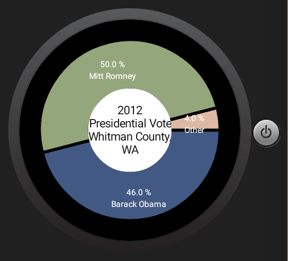

# PROG 02: Represent!

To use the app, enter a ZIP code to the text bar and press the Go Button. Alternatively, press the Detect My Location Button. Doing the former will return all the representatives and senators for your ZIP code, which may include more than one representative if the ZIP code covers multiple districts. Doing the latter will always return just three results every time. 
After selecting the appropriate location, both devices will switch to the Congressional Screen, which displays representative information in a horizontal scroll view. You can swipe through the views to access different representatives. To get more information, you can either swipe up on the bottom More Info tab on the mobile device, or press the representative’s portrait on the wear device.
You can also press the 2012 Election Button on the wear device to access your location’s voting results for the 2012 election. 
The device also switches to a random location if the wear device detects multiple consecutive changes in acceleration (Note: Up to three changes in acceleration). It does this by randomly selecting from a list of county latitude/longitude data downloaded from a census website.
## Authors

David Ni ([david.ni@berkeley.edu](mailto:david.ni@berkeley.edu))

## Demo Video

See [Prog2B Demo] (https://youtu.be/2W0Gy8LP-Fk)
See [Prog2C Demo] (https://youtu.be/-X8NwTZLtPc)

## Screenshots

## Acknowledgments
Thanks to the authors of the multiple 3rd party libraries I used in this assignment including...
	https://github.com/umano/AndroidSlidingUpPanel For my sliding up panel
	https://github.com/Pkmmte/CircularImageView For the circular image views
	https://github.com/PhilJay/MPAndroidChart For my vote view pie chart
	
As well as some sources I used for reference:
	http://code.tutsplus.com/tutorials/using-the-accelerometer-on-android--mobile-22125
	and
	http://stackoverflow.com/questions/2317428/android-i-want-to-shake-it
	for my accelerometer listener
	
	http://www.ssaurel.com/blog/learn-to-create-a-pie-chart-in-android-with-mpandroidchart/
	for an example MPAndroidChart pie chart usage
	
	http://stackoverflow.com/questions/4352172/how-do-you-pass-images-bitmaps-between-android-activities-using-bundles
	showing how to transfer bitmaps between a service and an activity using file system
	
	https://developer.android.com/training/wearables/data-layer/assets.html
	transferring image assets from one device to another using Data API
	
	http://stackoverflow.com/questions/14695537/android-update-activity-ui-from-service
	using a local broadcast system to communicate between services/activites
	
Data Resources I Used:
	https://piazza.com/class/ijddlu9pcyk1sk?cid=619
	Allowing easy mapping from key=County name to vote data
	
	https://www.census.gov/geo/maps-data/data/gazetteer2010.html
	For a CSV containing the lat/long of all USA counties for use in my on-shake random location function
	
